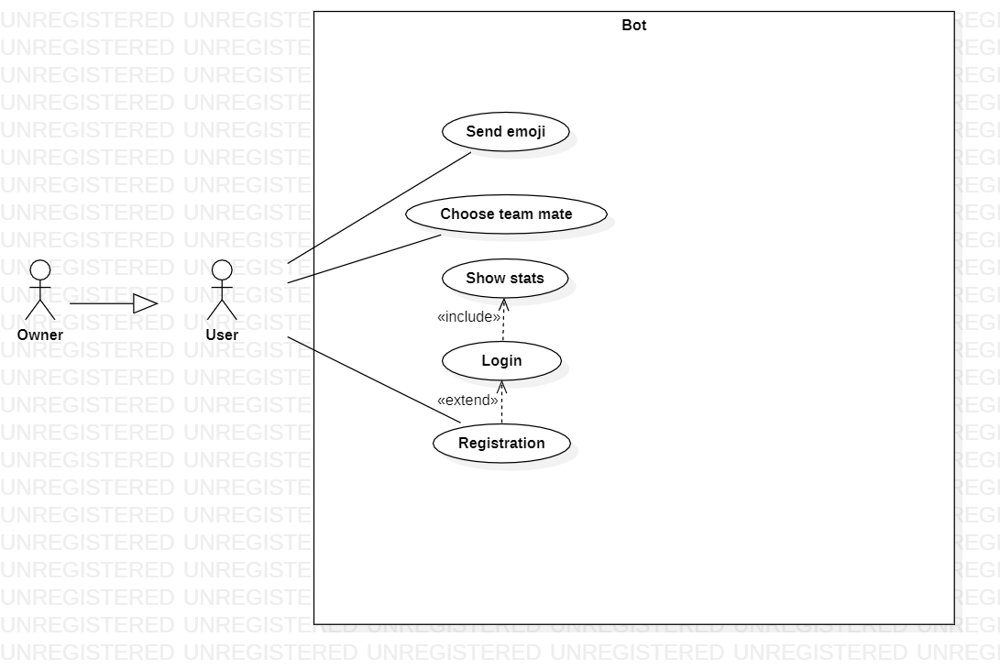
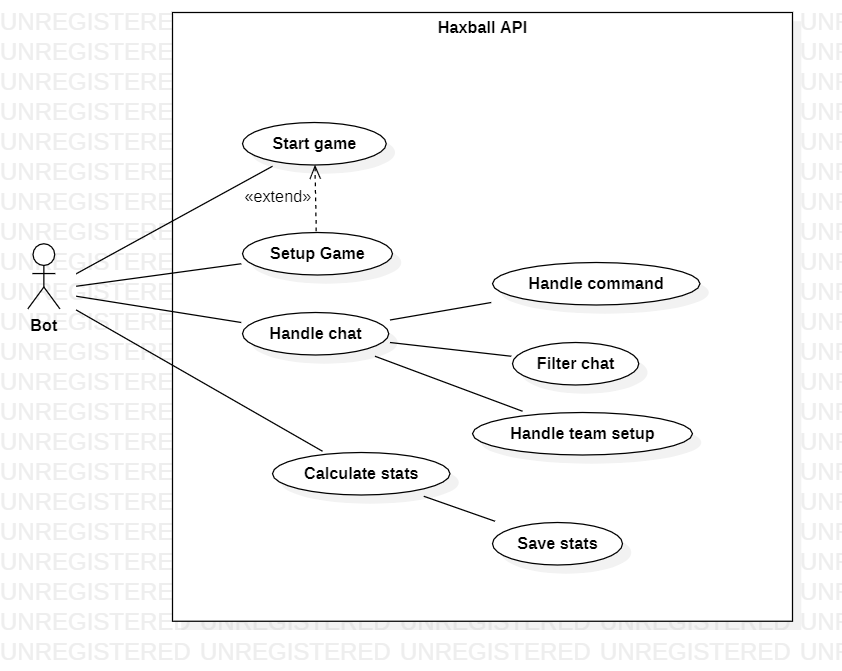

# Haxball Bot Room Manager
This is a project for course "Software Engineering" about design a bot for manage an Haxball's room.

# Contents
- [Abstract](#abstract)
- [Stakeholders](#stakeholders)
- [Functional and non functional requirements](#functional-and-non-functional-requirements)
	+ [Functional Requirements](#functional-requirements)
	+ [Non functional requirements](#non-functional-requirements)
- [Use case diagram and use cases](#use-case-diagram-and-use-cases)
	+ [Use case diagram](#use-case-diagram)
	+ [Use cases](#use-cases)
  
# Abstract

Haxball is a physics-based multiplayer soccer game without any login process. To play it's enough insert a nickname and choose a room to play. Anyone can create his room or partecipate to another's one, his architecture is a P2P architecture-based but a server entity is used to prevent attacks. Haxball's community is the core of the game, infact this game is really customizable and his users creates maps and gamemodes.
Cause of p2p architecture room's owner network is not suitable to handle multiple connection, or room's owner abuse their role to get an unfair game. To avoid those problems creator game enable users to make their own automated game rooms through [API](https://github.com/haxball/haxball-issues/wiki/Headless-Host))
Our stakeholder is a haxball player, sick of other game master's abuses, so he asks us a wonderful bot to manage his room.

# Stakeholders
| Stakeholder name  | Description        | 
| :---------------: |:-------------------|
| Users           | They are interested in finding a cool bot, that manage game in a fair and cool mode and it can show their achievments. | 
| Owners          | They are interested to improve Haxball Community with an automatized and fair system. |
| Devolpers       | They are interest to do a good platform that can be reused in others project and get their exam with maximum vote. |

# Functional and non functional requirements

## Functional Requirements
| ID       |Description  |
| ---------|:-------------| 
|  RF_1   | Handle automatically game initialization in a specified mode. |
|  RF_2   | Handle registration and authentication and make sure that nickname is unique. |
|  RF_3   | Monitor and save the stats for each game and registered players. |
|  RF_4   | Cool stuff chat with emoji's shurtcut. |
|  RF_5   | Avoid malicious behavior by players. |

## Non-Functional Requirements
| ID        | Type (efficiency, reliability) | Description  | Refers to |
| ------------- |:----------:| :---------------| :-----:|
| NF_1	| Usability | System should be easy to use throught a command list sended by chat. | All RF |
| NF_2 	| Disaster recovery | System should check and resolve disaster situation caused by human (ex. all entire team left). | All RF |
| NF_3 	| Safety | System should prevent bullying and sharing sensitive content by players. | RF_4 & RF_5 |
| NF_4 	| Security | System should use a two-factor auth. | RF_3 |
| NF_5 	| Reusability | System should be able to be reused (required a modular programming on [HHM](https://github.com/saviola777/haxball-headless-manager)) | All RF |

# Use case diagram and use cases
## Use case diagram
 
 
